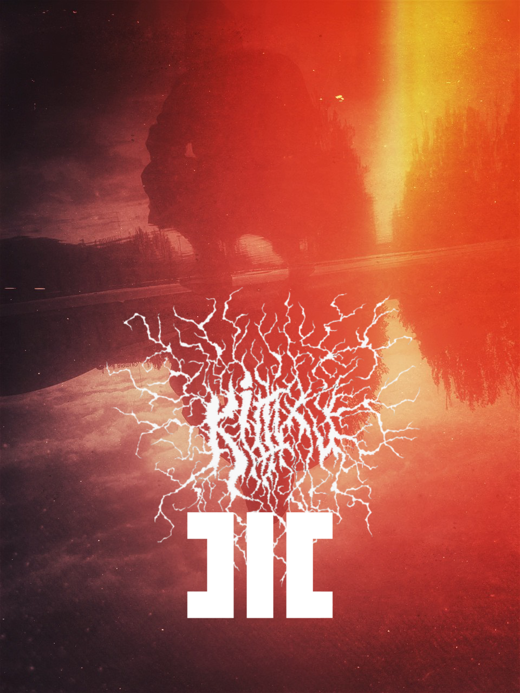

# Killlxv x MOTHNODE_ Hex

**Listen now:** 

## Project Data

Description.

> **Title:**  / **Featuring:** 

> **Production:**  / **Lyrics:** 

> **Beat:**

> **Narrative Design:**

> **Music Video Credits:**

## Lyrics

```

KILLLXV

I sigh with the death on my face
I walk around with a pair of blades
I cut and I fuck same pace
Got blood on my face I fuck with the taste
Better stay away or you'll be erased
Cuz I walk around with a pair of blades
And I cut and I fuck same pace
Betta (start) counting your days (you're) gonna be my sex slave

Like that white witch pull me out of black smoke ya. 
Give me more misery and put me out of hope
Leave her in a casket let her die slow
Half a dozen hexes on my past hoe
Grippin that flesh and rip out the bones
Cut into pieces and feed her to dogs
Defying the laws they say I'm a god aye
They say I'm a god yuh

MOTHNODE

those rites of a war they really for the weak yeah
all ya gotta... stay still, hex for the fix  
pure venomous spit, i dare you to speak truth
gag on your mouth and choke on it deep yeah
owe it to dust and empty chambers, stay there
till the very end of an endless spiral
make it last, my grit on revival
it's a fresh spit, it's a fresh spit ye
god is dead, carcass is rotten
my faith is alive but it's easily forgotten
i'm under the bottom (blood) 
dust on the ground, dust on the ground
crave that i can’t raise the faith
end grit in my lungs and i am dying again
day after day, for the truth, for the sins
what i've told yesterday crushed in my hands ey


THOSE rites of a war they really for the weak YEAH   -
All ya gotta, STAY STILL hex for the fix             - All ya gotta pray and prep hex for the fix
Pour THE venomous spit, I'll dare you to speak truth -
Gag on your mouth _so_ choke on it deep (aaah)       -

Those rites in a war are really for the weak (ye)    - 
All ya gotta SAY STILL hex for the fix               - 
It's a venomous spit, I dare you to speak (yeah)     - 
Gag IT on the mouth and choke on it deep (ah)        - 

Owe it to dust and the empty chambers                10             - I owe
Stay there, mind in an endless spiral                9              -
Prayers - make it last, my grit on revival           11             - Stay there to the very end in an endless SPIRAL
It's a fresh spit, it's a fresh spit ye              9

God is dead carcass is rotten                        8
My faith is alive but it's easily forgotten          12
Thought I'm under the bottom blood                   8
But I rise with the dust on the ground               8

Crave that i can’t raise the faith                   7
It's the grit in my lungs and i am dying again       12
Day after day, for the truth, for the sins           10
What i gave yesterday - crushed in my hands (ey)     11


(black black grave) It's the god slain in the flames                                 ---------------- Say what you did not mean... at all -------
I drop into feelings just swirling around 
Treacherous marks (still) carved deep into stones in the tombs


you're so deep into the ground, 
i cannot survive


yet i knew these thorns so pierced 
Fire the source of all suffering 
Beginning and end is what I bestowed on my life of the painless mind and the
Flesh is my utmost treat
I’ve got no reason to be


-------

i crave that i can’t raise the faith 
the grit in my lungs and i am dying again 
day after day, for truth, for the sins 
what i’ve gave yesterday still crushed in my hands ye
Say what you did not mean... at all. 
Descend into Feelings, just swirling around 
My signs still carved on stones 
deep in the tombs
So deep into the ground

See...  / Crude... Dust on the ground 
i crave that i can’t raise the faith and
grit in my lungs i am dying again 
day after day, for truth, for the sins 
(what) i’ve told yesterday crushed in my hands
I reign supreme I reign supreme
Say what you did not mean... at all. 
Descend into Feelings, just swirling around your souls
My signs are carved on stones deep in the tombs
So deep into ground i cannot survive
I owe it to the dust and the empty chambers 
Stay there to the end in the endless spiral 
Helpless but destined to be under the ground
make it last my grit on revival
God’s dead carcass is rotten 
My faith is alive yet but easily forgotten

```

## Lore Notes

## Music Video

## Short Cinematic Film

## Miscellaneous Notes

Plugins: CLA Vocals > Berserk Distortion > Vocal Rider > Nectar
